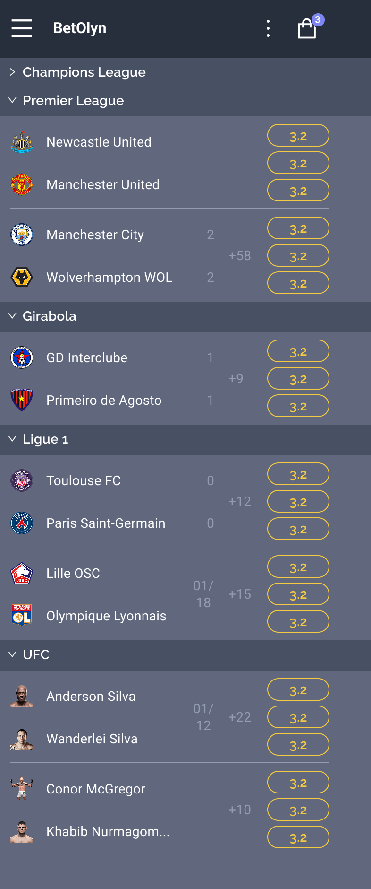
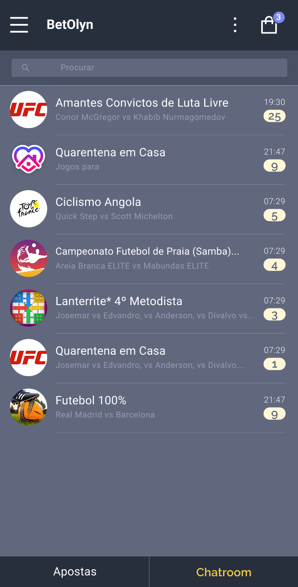
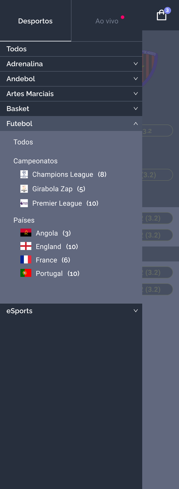
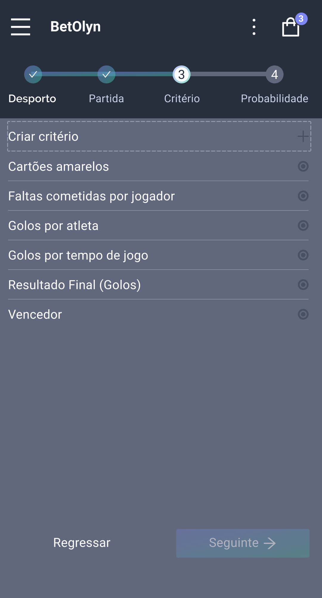

<center>
  <h2>Bet Olyn - Betting Platform</h2>
  <b>React Native + Spring Boot</b>
</center>

<br>

## 📱 Prototype Showcase

<div align="center">
  
  
  
  
  
</div>

<br />

> **Note:** This work is still in progress...

A social betting platform that brings friends together through friendly wagers and competitive fun. Built during the COVID pandemic as a way for friends to interact and collect points (or money) as entertainment, this platform has evolved into a comprehensive betting ecosystem.

## 🎯 Project Overview

The initial design was conceived during the COVID pandemic as a creative solution for friends to stay connected and engaged through friendly competition. What started as a simple amusement has grown into a sophisticated betting platform that combines real-world events with social interaction.

### Key Features
- **Real Event Betting**: Create bets based on real events registered in the platform (soccer games, eSports matches, etc.)
- **Custom Betting Channels**: Administrators can create public or private channels with custom "betting criteria"
- **Social Interaction**: Connect with friends through shared betting experiences
- **Flexible Scoring**: Support for both points-based and monetary betting systems

## 🎨 Design & Prototyping

The platform's design and user experience were carefully crafted in Figma:
**[View Design in Figma](https://www.figma.com/design/dMXqrCjoMJ1r0QYfCmijw8/Bet-Design?node-id=164-1869)**

## 🏗️ Project Structure (Monorepo)

```
/
├── mobile/          # React Native Expo application
├── backend/         # Backend service (Spring Boot)
├── README.md        # This file
├── .gitignore       # Root gitignore
└── Makefile         # Build and development scripts
```

## 🚀 Getting Started

### Prerequisites

- Node.js (for mobile app)
- Java 17+ (for backend)
- Maven 3.6+ (or use Maven Wrapper included in project)
- Expo CLI

### Development

#### Mobile App
```bash
make dev-mobile
# or
cd mobile && npm start
```

#### Backend
```bash
make dev-backend
# or
cd backend && ./mvnw spring-boot:run
```

## 🛠️ Available Commands

- `make dev-mobile` - Start the Expo development server
- `make dev-backend` - Start the Spring Boot development server
- `make install-mobile` - Install mobile app dependencies
- `make install-backend` - Install backend dependencies

## 🤝 Contributing

Each project maintains its own dependencies and configuration. Changes to the mobile app should be made in the `mobile/` directory, and backend changes in the `backend/` directory.

## 📱 Mobile App Features

The React Native mobile application provides an intuitive interface for:
- Browsing available betting channels
- Creating and managing bets
- Tracking betting history and results
- Social interactions with other users

## 🔧 Backend Services

The Spring Boot backend handles:
- User authentication and management
- Bet creation and validation
- Event registration and management
- Channel administration
- Real-time updates and notifications
