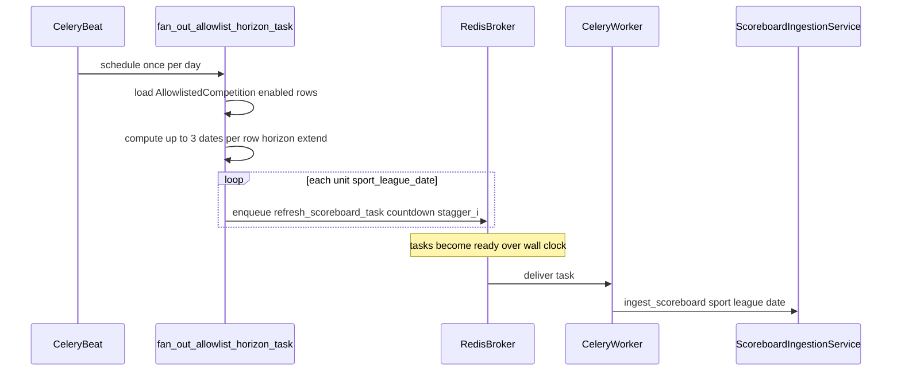

# Celery allowlist ingestion: fan-out + stagger (refactor plan)

This **supersedes** the cadence section of [ingestion-feed-architecture_63e82c3a.plan.md](./ingestion-feed-architecture_63e82c3a.plan.md) for **how** daily horizon work runs: the original doc’s “1× per day (spread)” was not implemented; the code today runs `[daily_allowlist_horizon_extend_task](../../apps/ingest/tasks.py)` once at **03:15 UTC** and calls `ingest_scoreboard` **inline** for every allowlist row in a tight loop (`[CELERY_BEAT_SCHEDULE](../../config/settings/base.py)`).

**Chosen scheduling (product):**

- **Option F — fixed wall-clock slots:** orchestrator assigns each child task an `**eta`** in UTC (first slot = configurable anchor, e.g. `ALLOWLIST_FANOUT_FIRST_SLOT_UTC` or derive from Beat run time), not only `countdown` from “now”.
- **10-minute spacing (Option A):** consecutive tasks use `**eta = anchor + n × 600s`** (env-tunable).
- **Option G (optional):** two (or more) Beat entries per day, each orchestrator enqueues **half** the allowlist (or half the date-chunk work) so each window’s tail is shorter; still **10 min** between tasks **within** a window.
- **Retries:** `**refresh_scoreboard_task` uses `max_retries=2`** (three attempts total including the first). Keep `**acks_late=True`** so the broker message is acknowledged only after the task body finishes (success or final failure per Celery rules).

## Target behavior

- **Orchestrator task** (new or slimmed rename of the daily task): **no** (or minimal) ESPN HTTP; it only **computes** work units `(sport_slug, league_slug, YYYYMMDD)` from the same horizon rules as today (`extend_cursor_date`, `MAX_FUTURE_DAYS` in `[tasks.py](../../apps/ingest/tasks.py)`) and **enqueues** existing `**[refresh_scoreboard_task](../../apps/ingest/tasks.py)`** (already wraps `ScoreboardIngestionService.ingest_scoreboard`) with `**apply_async(..., countdown=...)`** or `**eta=`** so executions are **spread** across minutes/hours.
- **Worker(s)** execute `**refresh_scoreboard_task`** as today. **You do not require two physical workers** for Celery to work: one pool can run both orchestrator and child tasks. **Optional:** dedicated consumer pool + queue for isolation (below).

## Configuration (new settings)

Add Django settings (env-backed) in `[config/settings/base.py](../../config/settings/base.py)` (or `local.py` overrides), for example:

| Setting                               | Purpose                                                                                        |
| ------------------------------------- | ---------------------------------------------------------------------------------------------- |
| `ALLOWLIST_FANOUT_STAGGER_SECONDS`    | Base delta between consecutive enqueued scoreboard tasks (e.g. 30–120s), or formula `n * step` |
| `ALLOWLIST_FANOUT_MAX_TASKS_PER_TICK` | Safety cap per orchestrator run (optional)                                                     |
| `CELERY_TASK_ROUTES` / queue name     | Optional route `refresh_scoreboard_task` to queue `ingest`                                     |

Document defaults in `[espn_service/README.md](../../README.md)` and `.env.example`.

## Cursor / `extend_cursor_date` semantics

Today the monolithic task sets `**extend_cursor_date`** to the **last date in `to_fetch`** after the loop, **even if a middle `ingest_scoreboard` failed** (`[tasks.py` L259–272](../../apps/ingest/tasks.py)).

**Refactor options** (pick one in implementation; recommend **B** for simplicity):

- **A – Parent advances after enqueue only:** same as today’s risk (failed child still “consumes” horizon); acceptable if upsert + next day’s run is OK.
- **B – Child advances on success:** extend `refresh_scoreboard_task` (or a thin wrapper) to `update_or_create` `**extend_cursor_date`** for that `AllowlistedCompetition` when ingest returns OK; orchestrator does **not** advance; use `**select_for_update`** or **per-competition ordering** so parallel tasks for the **same** comp don’t race (or enqueue **at most one outstanding date per comp** per day).
- **C – Chord:** orchestrator enqueues group + chord to advance once all three dates complete; more moving parts.

The plan should **explicitly choose B or A** in the PR to avoid silent cursor bugs.

## Monthly teams burst (same pattern, optional same PR)

`[monthly_allowlist_teams_task](../../apps/ingest/tasks.py)` also loops all rows synchronously. Apply the same **fan-out** using existing `**refresh_teams_task`**, with a **separate stagger** (often looser than scoreboard) to avoid one giant spike on the 1st.

## Optional: two queues / two worker deployments

Not required by Celery, but supported:

- Route `**refresh_scoreboard_task`** / `**refresh_teams_task`** to queue `**ingest`**.
- Default worker: `celery -A config worker -Q celery,ingest`.
- “Heavy” deployment: second process `celery -A config worker -Q ingest --concurrency=N`.

Update `**[docker-compose.yml](../../docker-compose.yml)**` / root compose with an optional second worker service or document a single worker with two queues.

## Beat schedule

Keep **one** Beat entry per job (daily horizon orchestrator, monthly teams orchestrator). Replace the **task name** in `[CELERY_BEAT_SCHEDULE](../../config/settings/base.py)` if you rename/split:

- `allowlist-daily-horizon` → `fan_out_allowlist_horizon_task` (or keep name, change implementation to fan-out only).

## Testing and ops

- **Unit tests:** orchestrator computes expected `(sport, league, date)` set and **mocks** `apply_async` to assert `countdown` / ordering.
- **Integration:** run worker + beat in CI or manual: verify Redis receives N delayed tasks, not N immediate ESPN calls in one process.
- **Observability:** structured logs on enqueue (comp key, date, countdown); existing task logs on completion.

## Documentation updates

- Add `**docs/ingestion_cadence.md`** (or section in README): orchestrator vs consumer, stagger env vars, optional second queue, alignment with original architecture plan (“spread” = wall-clock via Celery delays).
- Add a short **note at the top** of the old plan file (when editing): “Daily spread: see Celery allowlist fan-out plan” (user can do when merging docs).

## Out of scope (explicit)

- **Day-freshness / live today polling** (still deferred per original plan).
- **Betolyn** changes unless you also want Java sync cadence changed; this plan is **espn_service** ingestion only.

