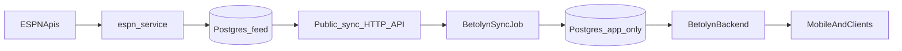

# ESPN Ingestion + Feed Sync Plan (revised)

> **Daily allowlist horizon — Celery scheduling:** load spreading, stagger env vars, and cursor semantics (**child finalizes on success**) are specified in the **Celery allowlist fan-out** plan ([`celery_allowlist_fan-out_176bfdae.plan.md`](./celery_allowlist_fan-out_176bfdae.plan.md)). See also [`../ingestion_cadence.md`](../ingestion_cadence.md).

## Decisions

- `**espn_service` owns Postgres `feed`** (ingested ESPN data): **isolated `feed` schema** (or equivalent table prefix / dedicated DB on same host—see deployment section). Betolyn app DB holds **product** tables + `**ingestion_state`** only.
- **Only `espn_service` calls ESPN**; Betolyn **never** calls ESPN upstream.
- **Feed → Betolyn (app) sync** uses a **public HTTP read API** exposed by `espn_service` (not direct JDBC to feed DB). **Higher latency is acceptable** (sync runs ~**every 2 hours**; HTTP cost is negligible vs the interval). `**ingestion_state`** (`watermark_updated_at`, `watermark_row_id`, `source` = `events` | `teams`) lives **only in the Betolyn DB** and advances after each successful batch **together with** `MatchEntity` / `TeamEntity` upserts (same app transaction).
- **Sync API authentication:** **none**—endpoints are **publicly reachable** by explicit product choice. Implications: **anyone can read** returned DTOs, **scrape**, and **load** your service—mitigate optionally with **edge rate limiting**, **separate hostname**, and **minimal DTOs** (no secrets, no PII). Revisit if abuse appears.
- **Multi-instance:** advisory lock or **ShedLock** on the Java scheduler so only one replica runs sync per `source`.
- **Teams**: full **monthly** ingest per allowlisted competition (Celery Beat)—use the right **team list source** per row (see below).
- **Events/matches**: **Cold start** then **daily 3-day chunks** (**extend mode**) until `**extend_cursor` reaches `today + MAX_FUTURE_DAYS`** (~**20** days, configurable). **At that cap:** **stop** the scheduled horizon ingest for that row—**no** daily rotating re-fetch of dates inside the window (keeps ESPN usage and logic simple). **Updates** to kickoff/time/status for dates already stored: **deferred** to a later **day freshness** job (re-hit ESPN or another API **when that calendar day is relevant**—e.g. match day / entering the product window). **POSTPONED:** **do not ingest**; if a row already exists, **delete** or **soft-delete** per product (bets)—see **Postponed events**. **v1:** no high-frequency `today` polling.
- **Missing competitor on event ingest**: look up team in `feed.team` (scoped by competition/league as you model it). If missing, **enqueue a team-ingest job** for **that competition’s team set**—**tournament/cup roster** for UEFA/FIFA/CAF/cup slugs; **league roster** for domestic `soccer` league rows (Girabola once slug known, EPL, Liga NOS, etc.)—**one HTTP call per triggered context**, not per missing competitor id.
- **Schema work (team colors, abbreviations, venue name, espn ids)**: primary target is **Betolyn’s app schema**; `espn_service` / `feed` should **populate** matching fields so the sync job can copy them (Django models may already expose equivalents—align names and parsers).

### Deployment when Postgres layout is constrained (multi-provider)

**Current sync path:** Betolyn **does not** need JDBC to the feed database when using the **HTTP sync API**. `**espn_service`** owns Postgres for `**feed`** (schema, table prefix, or dedicated DB). Betolyn JDBC is **app DB only** (`ingestion_state` + product tables).

Hosts differ: some **allow multiple schemas**; some **restrict** them. For **Python/feed** storage, prefer a `**feed` schema** (or `**ingestion_`* / `feed_`* table names**) with **least-privilege ingest roles**.

**Optional later:** SQL-first sync (Java reads `feed` + writes app in one DB) if you drop HTTP—then one Java datasource with `feed` + app access applies.

**If the provider does not allow a second schema:** use **prefixed ingest table names** in one schema. A full `**drop database`** on that instance still wipes **both** feed and anything colocated—see dev reset.

**Development: keep feed when you “reset the app database”**

- **Problem:** `dropdb` removes **everything**, including expensive re-ingest from ESPN.
- **With HTTP sync:** resetting **only** the **Betolyn** DB does **not** touch `**espn_service`’s feed Postgres** when they are **separate databases** (or you only drop the **app schema**). Re-run the Java sync after app reset to refill from the API.
- **Same host:** prefer **two DBs** or **two schemas**; avoid `dropdb` on feed when resetting app.
- **Production split** (feed service + DB vs Betolyn): **matches HTTP**—no FDW/replication required for sync; watch **feed API uptime** and **abuse** (rate limits).

**Summary:** **HTTP + app-only JDBC** simplifies Betolyn. Preserve feed with **isolated feed DB/schema** and **app-only resets**; `**ingestion_`* prefix** does not survive full DB wipe.

## Target architecture

### Sync read API (sketch)

Exposed by `**espn_service**` (Django REST or equivalent). **No authentication.** Betolyn calls with `**WebClient` / `RestTemplate`** from `@Scheduled` jobs.

**Suggested endpoints (internal naming, adjust to your URL style):**

- `GET /api/sync/teams?after_updated_at=&after_id=&limit=` — stable sort `**ORDER BY updated_at, id`**; response includes `**id`**, `**updated_at**`, fields needed for `**TeamEntity**` (`espn_id`, colors, abbreviations, etc.).
- `GET /api/sync/events?after_updated_at=&after_id=&limit=` — same cursor semantics for `**MatchEntity**` mapping.

**Semantics:** client passes **last processed** `(updated_at, id)` from `**ingestion_state`** (`watermark_updated_at`, `watermark_row_id`); server returns rows **strictly after** that tuple (same rule as SQL `(updated_at, id) > (watermark, id)`). Page until empty; then **one app DB transaction**: upsert entities + **advance watermarks**.

**Contract:** version DTOs (e.g. `/api/sync/v1/...`); document JSON schema; **minimal fields**—everything returned is **world-readable**.

**Optional hardening (still “no app auth”):** CDN/WAF **rate limits**, separate **hostname** for sync paths, monitoring on **traffic spikes**.

## Allowlisted competitions (v1)

Each row needs `sport_slug`, `league_slug`, and `**team_source`**: `league_roster` | `tournament_roster`.

**Sport slug for association football:** use `**soccer`** (not American `football`). Confirmed in [espn_service/README.md](../../README.md) and [apps/ingest/tasks.py](../../apps/ingest/tasks.py). Site scoreboard: `/apis/site/v2/sports/soccer/{league}/scoreboard`.

**Canonical league slugs** below match `[docs/sports/soccer.md](../../../docs/sports/soccer.md)` unless noted; **hit each with `get_scoreboard` once in dev** to confirm the site API returns games.

### Main domestic leagues

| Product name             | Sport (ESPN) | `league_slug` (soccer.md) | team_source     | Notes                                                                                                                                                                                              |
| ------------------------ | ------------ | ------------------------- | --------------- | -------------------------------------------------------------------------------------------------------------------------------------------------------------------------------------------------- |
| Girabola                 | `soccer`     | *TBD*                     | `league_roster` | **Not listed** in `soccer.md` Africa table (doc has `rsa.1`, `nga.1`, `gha.1`, etc.). Discover slug via ESPN/site search, then add to your registry and optionally contribute back to `soccer.md`. |
| La Liga                  | `soccer`     | `esp.1`                   | `league_roster` | Spanish LALIGA.                                                                                                                                                                                    |
| Premier League (EPL)     | `soccer`     | `eng.1`                   | `league_roster` |                                                                                                                                                                                                    |
| Liga NOS (Primeira Liga) | `soccer`     | `por.1`                   | `league_roster` |                                                                                                                                                                                                    |
| Bundesliga               | `soccer`     | `ger.1`                   | `league_roster` |                                                                                                                                                                                                    |
| Serie A                  | `soccer`     | `ita.1`                   | `league_roster` |                                                                                                                                                                                                    |
| Ligue 1                  | `soccer`     | `fra.1`                   | `league_roster` |                                                                                                                                                                                                    |

### UEFA club + international (high impact)

| Product name                  | Sport (ESPN) | `league_slug` (soccer.md) | team_source         | Notes                                                                                                                                    |
| ----------------------------- | ------------ | ------------------------- | ------------------- | ---------------------------------------------------------------------------------------------------------------------------------------- |
| UEFA Champions League         | `soccer`     | `uefa.champions`          | `tournament_roster` |                                                                                                                                          |
| UEFA Europa League            | `soccer`     | `uefa.europa`             | `tournament_roster` |                                                                                                                                          |
| UEFA Europa Conference League | `soccer`     | `uefa.europa.conf`        | `tournament_roster` |                                                                                                                                          |
| UEFA Nations League           | `soccer`     | `uefa.nations`            | `tournament_roster` | National-team windows.                                                                                                                   |
| FIFA World Cup                | `soccer`     | `fifa.world`              | `tournament_roster` | Per doc; cycle-specific config if slug ever changes.                                                                                     |
| FIFA Club World Cup           | `soccer`     | `fifa.cwc`                | `tournament_roster` | Per doc.                                                                                                                                 |
| International friendly        | `soccer`     | `fifa.friendly`           | `tournament_roster` | Per [soccer.md](../../../docs/sports/soccer.md) § International / FIFA; national-team style listings. |

### CAF / Africa (high impact)

| Product name                    | Sport (ESPN) | `league_slug` (soccer.md) | team_source         | Notes                                                                |
| ------------------------------- | ------------ | ------------------------- | ------------------- | -------------------------------------------------------------------- |
| CAF Champions League            | `soccer`     | `caf.champions`           | `tournament_roster` |                                                                      |
| CAF Confederation Cup           | `soccer`     | `caf.confed`              | `tournament_roster` |                                                                      |
| Africa Cup of Nations (AFCON)   | `soccer`     | `caf.nations`             | `tournament_roster` | Tournament phase.                                                    |
| AFCON qualifying                | `soccer`     | `caf.nations_qual`        | `tournament_roster` | Separate from `fifa.worldq.caf` in doc.                              |
| FIFA World Cup qualifying (CAF) | `soccer`     | `fifa.worldq.caf`         | `tournament_roster` | Use if you want CAF WCQ as its own row (doc § International / FIFA). |

### Major domestic cups (high impact)

| Product name     | Sport (ESPN) | `league_slug` (soccer.md) | team_source         | Notes |
| ---------------- | ------------ | ------------------------- | ------------------- | ----- |
| Taça de Portugal | `soccer`     | `por.taca.portugal`       | `tournament_roster` |       |
| Copa del Rey     | `soccer`     | `esp.copa_del_rey`        | `tournament_roster` |       |
| Coppa Italia     | `soccer`     | `ita.coppa_italia`        | `tournament_roster` |       |
| DFB-Pokal        | `soccer`     | `ger.dfb_pokal`           | `tournament_roster` |       |
| Coupe de France  | `soccer`     | `fra.coupe_de_france`     | `tournament_roster` |       |
| FA Cup           | `soccer`     | `eng.fa`                  | `tournament_roster` |       |

### Other sports (existing)

| Product name | Sport (ESPN) | team_source                            | Notes                                                 |
| ------------ | ------------ | -------------------------------------- | ----------------------------------------------------- |
| UFC          | `mma`        | `tournament_roster` or `league_roster` | Typically `ufc`; confirm ESPN shape vs 2-side soccer. |
| Tennis       | `tennis`     | `league_roster`                        | Often **ATP** + **WTA** as two rows.                  |
| NBA          | `basketball` | `league_roster`                        | `nba`.                                                |

**Soccer row count for scoreboard math**: 7 leagues + **7** UEFA/FIFA (incl. `fifa.friendly`) + 5 CAF/Africa + 6 cups = **25** rows. *Optional:* drop `fifa.worldq.caf` or `caf.nations_qual` → **24**; merge both → **23**.

### Optional later

- **Copa Libertadores / Brasileirão** — add if product confirms.
- **Cycling & F1** — deferred (non–1v1); separate participant model if ever added.
- **Secondary data provider** for scores/live + **canonical normalization** (ids, status, clocks)—pairs with optional high-frequency refresh when you leave ESPN-only fixture mode.

## ESPN request volume — 3-day chunks, **20-day cap**, stop at cap

**Mechanism**: one HTTP GET per `/apis/site/v2/sports/{sport}/{league}/scoreboard` per **calendar date** (`[espn_client.py](../../clients/espn_client.py)` — `get_scoreboard`).

**Why a cap:** an unbounded cursor would **accumulate events forever** (storage, sync, UI noise). **~20 days ahead** is enough for betting-style discovery; older than that rarely needs to live as first-class feed rows in v1.

**Constants (config):** `MAX_FUTURE_DAYS = 20` (inclusive offset from ingest job’s **calendar today** in agreed TZ). Per allowlist row keep `**extend_cursor`** (end date of last forward chunk successfully loaded).

### Cold start (once per deploy / empty DB / new competition)

For each allowlist row, fetch **three** consecutive calendar dates starting at **run date** (e.g. Mon, Tue, Wed). Set `**extend_cursor`** = Wed.

- **Soccer 25 rows** × 3 = **75** GETs
- **+ UFC** 3 + **NBA** 3 + **Tennis** 3 or 6 → **84** (one tennis slug) or **87** (ATP + WTA)

Spread across time to avoid burst.

### Extend mode (daily, until horizon cap)

While `**extend_cursor < today + MAX_FUTURE_DAYS`** (next chunk’s dates must stay ≤ `today + MAX_FUTURE_DAYS`):

- Fetch `**extend_cursor + 1`**, `**+2`**, `**+3**` (e.g. Thu–Sat after Mon–Wed). If the chunk would cross the cap, **fetch only** dates **≤ `today + MAX_FUTURE_DAYS`** (1–2 GETs that day for that row, then you’re at cap).
- Advance `**extend_cursor**` to the last date actually fetched.

**Overlap** between chunks is OK: **idempotent upserts** on `espn_id` (skip **POSTPONED**—see below).

### At horizon cap — **no rotating refresh** (v1)

When `**extend_cursor` has reached `today + MAX_FUTURE_DAYS`** (and any partial last chunk is done):

- **Do not** keep running a daily job that re-downloads triplets **inside** the 21-day window just to “refresh” them. That was **rejected** as unnecessarily complex.
- **Do not** keep extending farther than `today + MAX_FUTURE_DAYS`.
- **Staleness** (time changes, non-postponed edits) for already-ingested dates is **acceptable until day freshness** exists.
- **Later — day freshness (separate feature):** periodically re-fetch **when a calendar day is relevant** (e.g. **today**, **tomorrow**, or “N days before kickoff”) so rows **upsert** without a full-window rotation. May use ESPN again and/or **another API** + **normalization**—design when you implement that phase.

**Rough steady-state ESPN cost after cap:** **~0** scheduled scoreboard GETs for horizon extension (until you reset cursor after long downtime or add day freshness). **While still extending:** ~**84–87** GETs on each day you advance chunks.

**Optional retention:** archive or soft-delete `event_date < today - N`.

### Postponed events (product rule)

- Map ESPN payload to **POSTPONED** (exact mapping from `status` / `state` in the client).
- **Do not ingest** postponed fixtures (skip insert).
- **If already stored:** remove from product data (**hard delete** `feed` + **Betolyn** / `MatchEntity` and dependents, **or** **soft-delete / hidden** if open bets or policy forbid hard delete—**product decision**).
- **Rescheduled:** when the fixture appears again as non-postponed, normal **upsert**.

### High-frequency `today` / live freshness — **not in v1**

- **Deferred** with horizon extension: no **every-2h `today`** loop. **Day freshness** (above) is the intended place to revisit **specific days** when you need fresher data.

### On-demand team ingest (unchanged)

- **One** roster fetch for the **parent competition** (`sport` + `league` of the event), not one HTTP call per missing team id.

### Anti-patterns

- **Unbounded** `extend_cursor` with no cap.
- Re-fetching the **same** 3-date chunk every few minutes.
- **No reconciliation** after downtime—run catch-up extend chunks until cursor reaches cap or `today+MAX`, then resume refresh rotation.

## Ingestion cadence (summary)

| Job                        | Frequency                        | Behavior                                                                                                                                                                   |
| -------------------------- | -------------------------------- | -------------------------------------------------------------------------------------------------------------------------------------------------------------------------- |
| **Teams**                  | **Monthly** (per allowlist row)  | League roster **or** tournament team list per `team_source`.                                                                                                               |
| **Scoreboard / horizon**   | **1× per calendar day** (spread) | **Extend:** next 3 dates after cursor until `today+20`. **At cap:** same 3 GETs/row/day, **rotate** dates inside `[today, today+20]` to refresh existing events (upserts). |
| **Live / `today` polling** | **Not v1**                       | Optional later: other API + normalization; or Tier-A ESPN `today` on interval if product requires.                                                                         |
| **Team backfill**          | **On demand** (queued)           | Missing competitor → one parent-competition roster fetch.                                                                                                                  |

Implementation: extend `[services.py](../../apps/ingest/services.py)` and `[tasks.py](../../apps/ingest/tasks.py)` with allowlist-driven loops; add **tournament-scoped** client method(s) where ESPN exposes them (exact paths validated during implementation).

## Betolyn schema: `TeamEntity` and `MatchEntity` (primary migrations)

**Scope:** extend **Betolyn’s JPA entities and DB tables** (e.g. `TeamEntity`, `MatchEntity` under `[betolyn/backend](../../../../backend)`) so the product DB holds presentation + sync keys. The **feed** schema in `espn_service` is populated first; the **Betolyn sync job** copies into these columns.

### `TeamEntity` (Betolyn)

| Column / field      | Purpose                                                                             |
| ------------------- | ----------------------------------------------------------------------------------- |
| `espn_id`           | External ESPN team id (string); uniqueness rules with channel/tenant as you define. |
| `color`             | Primary hex.                                                                        |
| `alternate_color`   | Secondary hex (ESPN `alternateColor`).                                              |
| `short_name`        | Short display label for UI.                                                         |
| `name_abbreviation` | Short code (e.g. 2–4 chars).                                                        |

### `MatchEntity` (Betolyn)

| Column / field | Purpose                                                               |
| -------------- | --------------------------------------------------------------------- |
| `espn_id`      | Canonical ESPN event id (idempotent sync / dedupe).                   |
| `venue_name`   | Denormalized venue string for UI (optional normalized `Venue` later). |

Also keep a **stable sync join** (e.g. `external_event_id` or reuse `espn_id` on match) aligned with `feed.event.espn_id`.

### `ingestion_state` (Betolyn app schema)

Stores **per-source sync cursors** for the Java **HTTP** feed→app job. **Exactly two rows** after seed: `source IN ('events', 'teams')` (enforce with `CHECK` or enum). Watermarks map 1:1 to sync API query params `**after_updated_at`** / `**after_id`**.

| Column                      | Type / notes                             | Purpose                                                                                                                                                                                                                                 |
| --------------------------- | ---------------------------------------- | --------------------------------------------------------------------------------------------------------------------------------------------------------------------------------------------------------------------------------------- |
| `**source`**                | `VARCHAR` PK or enum                     | `events` — sync from `feed` events (→ `MatchEntity`). `teams` — sync from `feed` teams (→ `TeamEntity`).                                                                                                                                |
| `**watermark_updated_at`**  | `TIMESTAMPTZ` (nullable until first run) | High-water `**updated_at**` from feed/API through which this source has been **successfully** applied. Next HTTP request: `**after_updated_at`** = this value; same lexicographic rule as `**(updated_at, id) > (watermark, row_id)`**. |
| `**watermark_row_id`**      | `BIGINT` (nullable)                      | Tie-breaker: last processed **feed row id** (API field); `**after_id`** in the next request.                                                                                                                                            |
| `**last_run_started_at`**   | `TIMESTAMPTZ` nullable                   | When the current/last sync attempt started (ops / debugging).                                                                                                                                                                           |
| `**last_run_completed_at`** | `TIMESTAMPTZ` nullable                   | When the last **successful** batch finished.                                                                                                                                                                                            |
| `**last_error`**            | `TEXT` nullable                          | Last failure message if a run failed before cursor advance.                                                                                                                                                                             |
| `**row_updated_at`**        | `TIMESTAMPTZ`                            | When this `ingestion_state` row was last written (audit).                                                                                                                                                                               |

**Rules:** advance `**watermark_*`** only in the **same database transaction** as the corresponding `**MatchEntity` / `TeamEntity`** upserts for that batch. On failure, **do not** bump the watermark. **Seed** both rows at deploy (watermarks `NULL` = “sync from beginning” or set to `epoch` per product).

### Ingestion / feed (supporting only)

`espn_service` Django models (`[apps/espn/models.py](../../apps/espn/models.py)`) already expose much of this (`espn_id`, `color`, `alternate_color`, `abbreviation`, `short_display_name`, `Event` + `Venue`). **Ingestion** should populate feed fields that **map 1:1** into `TeamEntity` / `MatchEntity` (add `venue_name` on feed `Event` if you want sync without joining `Venue`). Naming in feed can stay Django-native; **sync layer** maps `short_display_name` → `short_name`, `abbreviation` → `name_abbreviation`, etc.

**Competitors (scoreboard ingest):** **do not** `delete()` all competitors then recreate. Use `**update_or_create`** per `(event, team)` only; **optionally delete orphans**—remove `Competitor` rows for that `event_id` whose `team_id` is **not** in the current `competitors` payload (handles rare ESPN shape changes without wiping stable rows every run). This cuts churn (PK churn, extra writes) and aligns with **watermark-driven** downstream sync.

**Semantic `updated_at` for watermarks:** Django `auto_now` on `Event`/`Team` bumps `**updated_at` on every `save()`**, so Betolyn’s `**ingestion_state`** cursor would re-pull **every** row on each scoreboard run. For efficient sync, **only advance feed `updated_at` when normalized fields actually change** (compare before save, or set `feed_updated_at` / `content_hash` explicitly). Same idea for **team** roster pulls.

## Phase 0 — Registry, contracts, slug validation (do now against repo docs)

**Authoritative references in this repo:**

1. **[docs/sports/soccer.md](../../../docs/sports/soccer.md)** — league slugs for **soccer** (tables: International/FIFA, UEFA, England, Spain, … Africa/CAF). Use the `**league_slug`** values from the doc for every soccer allowlist row **except Girabola** (discover separately).
2. **[espn_service/README.md](../../README.md)** — confirms `**soccer`** + slugs like `eng.1`, `uefa.champions`; documents **site** vs **core** base URLs and scoreboard-oriented usage.

**Validation checklist (before production):**

- For **each** allowlist row, call the **site** scoreboard (same path `espn_service` uses in `[get_scoreboard](../../clients/espn_client.py)`) with `(sport, league, date)` and confirm non-empty or gracefully empty responses.
- **Girabola**: find working `league_slug` (not in `soccer.md` today); document in your allowlist registry.
- **UFC / NBA / tennis**: README table — `mma`/`ufc`, `basketball`/`nba`, `tennis`/`atp` & `wta`.
- **World Cup / Club WC / CAF / cups**: cross-check slug strings against **soccer.md** rows used in the allowlist tables above (`fifa.world`, `fifa.cwc`, `caf.nations`, `eng.fa`, etc.).
- Allowlist config table: `sport_slug`, `league_slug`, `display_name`, `team_source`, `enabled`, `scoreboard_tier` (for scheduling), cron/interval fields.
- **Feed → Betolyn mapping doc**: include `TeamEntity` / `MatchEntity` / `ingestion_state` fields above.
- **API contract**: mobile unchanged where possible; document **public sync read API** (query params, DTOs, pagination, versioning); document new optional presentation fields on product API.

## Phase 1 — Postgres + `espn_service`

- `feed` schema migrations aligned with Betolyn-bound fields (or `**ingestion_*` / `feed_*` table prefix** on same DB if schemas are disallowed—see **Deployment when Postgres layout is constrained**).
- **Implement public sync read API** (teams + events) with cursor pagination backed by `**updated_at` + row `id`**; keep DTOs minimal.
- Celery: monthly per-row team ingest; recurring 3-day scoreboard; **tournament vs league** team backfill.
- Event ingest: upsert events; **competitor upsert + optional orphan delete** (no full competitor wipe); **semantic `updated_at`** so API watermarks stay meaningful; queue **correct** team ingest on miss.

## Phase 2 — Betolyn migrations + sync

- Apply **Betolyn** migrations: `**TeamEntity`**, `**MatchEntity`**, `**ingestion_state**` (seed rows `source = 'events'` and `'teams'`).
- **Feed → app sync (Java):** Spring `**@Scheduled`** ~**every 2 hours** (`application.yml`). Configure **base URL** for `espn_service` sync API. **Two passes:** for each `source`, read `**ingestion_state`**, call `**GET .../teams`** or `**.../events**` with `**after_updated_at` / `after_id` / `limit**`, loop until empty; map JSON → `**TeamEntity` / `MatchEntity**`; idempotent upsert by `espn_id`. Same app DB transaction: persist upserts + update `**watermark_updated_at` + `watermark_row_id**` to batch max. **Multi-instance:** **ShedLock** or advisory lock per `source`. **HTTP failures:** log, optionally set `**last_error`** on `ingestion_state`, **do not** advance watermark.
- **Deletes** (e.g. POSTPONED): API may expose **tombstones** or **omit** rows—document behavior; Betolyn may need explicit delete/reconcile rules.

## Phase 3 — Performance & reads

- **Feed DB / API:** index `**(updated_at, id)`** on source tables backing sync endpoints; cap `**limit`** server-side.
- **App DB:** index `**espn_id`** on `**teams` / `matches`**; PK `**ingestion_state(source)`**.

## Phase 4 — Verification & cutover

- Shadow compare; flags; SSE; rollback.

## Testing

- Domestic league: missing team triggers **league** roster fetch once.
- UCL/CAF/World Cup: missing team triggers **tournament** team fetch once.
- Monthly job idempotency; 3-day scoreboard for one row; World Cup slug switch simulation.

## Execution order

1. Allowlist + `team_source` + ESPN path validation (tournament vs league).
2. **Betolyn** schema migrations (team + match + `**ingestion_state`**).
3. Feed ingestion + **sync HTTP API** + parsers + tournament team client methods.
4. Java **HTTP** sync (`@Scheduled` ~2h) + `**ingestion_state`** watermarks.
5. Cutover and request-volume tuning.

## Future evolution

- F1/cycling participant model; optional **direct JDBC** to feed for lower latency if HTTP ever becomes a bottleneck; HTTP BFF—unchanged **ESPN-only-in-Python** boundary.

